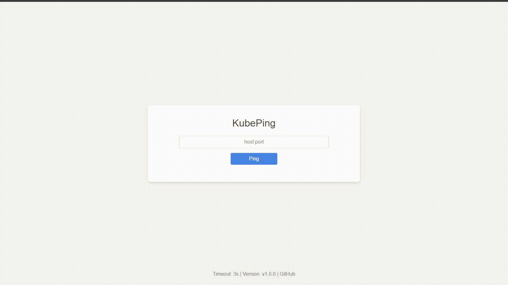

# KubePing

A solution designed to monitor the availability of external endpoints from each node in a Kubernetes cluster over TCP, HTTP, and ICMP in real time. It exports Prometheus metrics and provides a user-friendly web interface, eliminating the need for manual checks on individual nodes.

<p align="center">
    
</p>

## Use case
In Kubernetes environments, ensuring reliable access to external endpoints is critical. Dependencies such as databases, APIs, and third-party services can become single points of failure, and connectivity issues often result in degraded performance or outages.

Troubleshooting is typically done by manually running tools like telnet, curl, or ping on individual nodes. This approach is slow, repetitive, and does not scale well, even when partially automated, especially in large clusters.

__KubePing__ solves this problem.

## How It Works
The solution runs a lightweight DaemonSet in Kubernetes, ensuring an exporter instance on every node. Each instance probes external endpoints via:

__TCP__ Checking port availability (e.g., database:5432, api:443)\
__HTTP__ Ensuring services respond with the expected status codes\
__ICMP (Ping)__ Verifying network reachability

<p align="center">
    
</p>

The results are aggregated and exposed as Prometheus metrics:
```
kubeping_probe_result{address="api.example.az:8080", instance="worker-node-1", job="kubeping", module="tcp", target="target1"}=1
kubeping_probe_result{address="api.example.az:8080", instance="worker-node-2", job="kubeping", module="tcp", target="target1"}=0
kubeping_probe_result{address="api.example.az:8080", instance="worker-node-3", job="kubeping", module="tcp", target="target1"}=1

kubeping_probe_result{address="https://example.az", instance="worker-node-1", job="kubeping", module="http", target="target2"}=0
kubeping_probe_result{address="https://example.az", instance="worker-node-2", job="kubeping", module="http", target="target2"}=1
kubeping_probe_result{address="https://example.az", instance="worker-node-3", job="kubeping", module="http", target="target2"}=1

kubeping_probe_result{address="192.168.0.1", instance="worker-node-1", job="kubeping", module="icmp", target="target3"}=1
kubeping_probe_result{address="192.168.0.1", instance="worker-node-2", job="kubeping", module="icmp", target="target3"}=0
kubeping_probe_result{address="192.168.0.1", instance="worker-node-3", job="kubeping", module="icmp", target="target3"}=1
```

## Instant checks

Use the web UI to run ad-hoc connectivity tests across all nodes at once
<p align="center">
    
</p>

## How to install
Add Helm repository
```
helm repo add teymurgahramanov https://teymurgahramanov.github.io/charts && helm repo update teymurgahramanov
```
Install Helm chart
```
helm upgrade --install kubeping teymurgahramanov/kubeping \
--namespace kubeping \
--create-namespace
```
Access Web UI on http://localhost:8000
```
kubectl -n kubeping port-forward svc/kubeping-web 8000:8000
```
To configure the exporter with static targets, see the example under `exporter.config` in [values.yaml](./helm/values.yaml).
